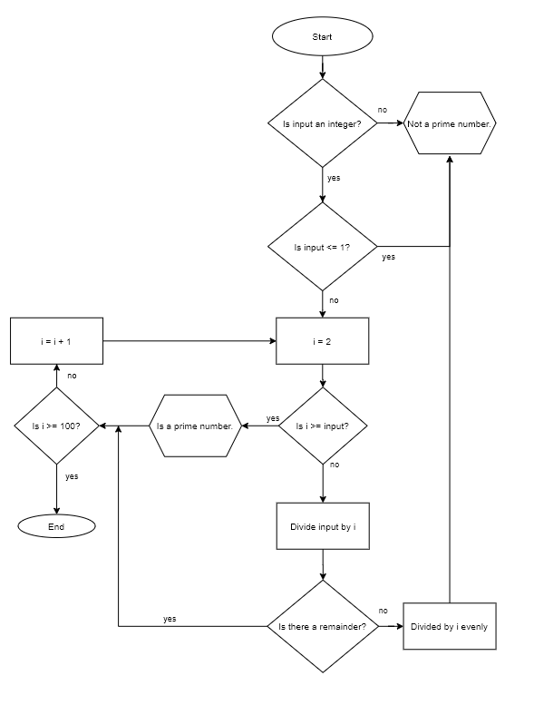

# Workbook - T1A1 - Nathan Blaga

## **Question 1:**

The development of the Internet from the 1980s until today consisted of massive expansion and rapid evolution. This was mostly due to advancements in technologies, knowledge and vision. Below are several key moments that assisted in the formation and growth of the Internet we know today.

### **1984: Domain Name System (DNS)**

Prior to the introduction of DNS, internet users interacted with the internet through host’s numerical IP addresses in order to send and receive information and data. This in itself was not only a frustrating task, but impractical and non-user friendly. This underlying issue was resolved with the introduction of DNS in 1984. The system acts as a translator. The user enters a designated domain name or Uniform Resource Locator (URL) associated with the content they wish to access. The system then translates said domain name to the corresponding numerical IP address needed for locating and identifying the users’ intended path. The introduction and evolution of DNS aided the formation of a more ‘user-friendly internet’ that helped advance the Internet’s functionality and adaptiveness (Mockapetris 1987).

### **1988: IRC – Internet Relay Chat**

IRC is a teleconferencing system providing a point of contact to which clients may connect and talk to each other (Oikarinen and Reed 1993). At its core, IRCs are simple computer systems that connect and transmit communications between two users through text. Although programs such as Facebook’s messenger have replaced IRC’s, without their introduction in the 1980s, there would have been no flagship technology to pave the way for today’s various forms of messaging. This includes messaging apps, programs and “add-on” features on popular devices in the modern tech world.

### **1988: First major malicious internet-based attack**

As mentioned in Dressler 2007, on the 2nd of November 1988, the panels of history witnessed one of the world’s first computer worms via the internet. Robert Tappan Morris, a graduate student at Cornell University, created and launched an attack which was one of the very first cases to gain mainstream media attention and resulted in a felony conviction. The takeaway from this historical event was not the fact that someone discovered flaws in a complex system such as the internet. Rather it sparked, the intervention of officials to act, moreover the widespread coverage from the media created a fear of using the internet and computer networks. This in turn ignited a necessity for better protection on the internet, networks and the very users around the world from future attacks.

### **1991: First web page created**

According to E Nix 2018, in 1989, a British computer scientist, Tim Berners-Lee, proposed an information management system that used hypertext to link documents on different computers that were connected to the internet. The following year, Berners-Lee developed the technologies that became the very foundations of the today’s internet. This included HTML, HTTP and URLs. Finally, on the 6th of August 1991, Berners-Lee published the first ever website. This single development revolutionised the way in which the internet was perceived. Through Berners-Lee’s efforts, a more commercialised internet was born, paving the way for the internet we know today.

### **1998: Google**

Google began as a research project for Larry Page and Sergey Brin and eventually became the cornerstone for the internet itself. The duo created the PageRank algorithm, named after Larry, to rank the search results based on linking behaviour. The two technologies formed the foundation for the world’s most powerful search engine of its time (Verge Staff 2018). Throughout the years, Google not only redefined the internet and the way users interacted with search engines. It also established itself as an entity beyond the name “Google” that translated to different planes, including the tech space, marketability, new trends, media and future projects.

## **Question 2:**

### **Packets**

When small amounts of data are sent over networks such as the internet or a LAN, they are referred to as a packet. The packet itself is comprised of its content (data), its starting point and its final destination (Christensson 2018). Packets have been a very impactful contribution to the development of the internet as they aid in establishing network efficiency, are very reliable and resilient to change.  Each packet is allowed to find its own path to its destination and does not require an open dedicated connection between the networks. This in turn means networks can perform various tasks with other networks while waiting for the packets to arrive (Walton).

### **IP addresses (IPv4)/ (IPv6)**

“Every computer system and device connected to the internet is located by an IP address” (Christensson 2006). IPv4 is the most widely used version of the internet protocol with IPv6 also known as ‘IP next generation’. The main difference between the two is that IPv4 defines IP addresses in a 32-bit format while IPv6 used 128-bit format. The internet protocol is the underlying technology that makes it possible for users to connect our devices to the World Wide Web. Without the protocol, data cannot be accessed or even transferred between networks. Without this very backbone, the internet would be crippled and unusable (Christensson 2009).

### **Routers / Routing**

Routers are a hardware device that routes data form a local area network (LAN) or the internet to another network connection. While routing is the process of selecting a path across one or more networks to route packets of data back and forth along said pathway (Christensson 2006). Walton quotes “The router is a fundamental building block of modern business networks.” This encapsulates routers and how effective and efficient their impact has been on the development of the internet.  In addition to working as a gateway of networks, they can also perform secondary functions that are very beneficial to the network itself. These roles include checking traffic coming in and out of the network, firewall functions and can work as a network switch if needed (Walton).

### **Domains / DNS**

“A domain contains a group of computers that can be accessed and administered with a common set of rules” (Christensson 2006).  As mentioned in the previous question; DNS acts as a translator, translating a domain name or URL to the corresponding numerical IP address needed for locating and identifying the users’ intended path (Christensson 2006). Domains help the development of the internet by cementing its place in the corporate world. This allowed companies to network all local computers together so that they could better oversee how effective and efficiently all their employees operate. In addition by setting a domain within the company’s network, this would in turn block outside traffic from accessing the company’s network, adding an extra level of security and privacy to high level information and data.

## **Question 3:**

### **TCP**

TCP stands for (Transmission Control Protocol) and works in junction with IP (Internet Protocol) within the Internet protocol suite. “TCP is a standard that defines how to establish and maintain a network conversation through which application programs can exchange data” (Rouse 2020). When two applications/users using TCP wish to exchange data/information between themselves, they must first establish and maintain a connection. Once this has been achieved TCP will use the port numbers to direct the flow of data to the desired destination. These port numbers are attached to the packets of data being transferred between the two users (Rouse 2020). Not only does TCP handle the transmission of data but provides oversight with error-free transmission as it acknowledges any retransmissions of data packets and any ‘empty’ or ‘garbage’ packets (Hunt 2002). TCP has contributed to the development of the internet and of client server communication in a multitude of ways. Two main contributions would be that of integrity and reliability of transferable data. Without TCP there would be no rules or procedures in place to oversee data and information being transferred across networks in a consistent, safe and effective manner.… it is flexible and highly scalable, meaning new protocols can be introduced to it and it will accommodate them” (Rouse 2020). TPC’s independence from any specific physical network hardware also allows it to be run over any form of network which in turn gives it boundless adaptability to any situation (Hunt 2002).

### **HTTP & HTTPS**

HTTP stands for Hypertext Transfer Protocol, which uses TCP over port 80 to send and receive data packets over the web. After the initial TCP handshake. A client and server can send a request to gain access to an HTTP server/website. “To put it simply it is a protocol that’s used by a client and server which allows you to communicate with other websites” (Jackson 2016).
Without a protocol such as HTTP, a user would not have a method in which to interact with other servers and request web resources over any networks. At its core, HTTP works as an acknowledgement between user and server, without this there would be no way to share data and information, view websites, or access networks remotely. HTTPS stands for Hypertext Transfer Protocol Secure, also uses TCP to send and receive data packets, this however is done over port 443, within a connection encrypted by Transport Layer Security (TLS) (Jackson 2016). In regards to the benefits of using HTTPS, a user can gain security and confidence. HTTPS adds security and safeguards the users from, hackers, malware attacks and insecure networks. In addition an extra layer of trust and confidence is formed, as the user can feel more ‘at ease’ knowing there is a level of protection over their sensitive information. HTTPS has been a cornerstone in the development of the internet and communications as it paved security and confidence in users and customers alike to be attracted to online shopping, online banking, two sided market places and e-commerce. Without a protocol such as HTTPS to safeguard a website and server’s integrity and legitimacy, the development of todays’ e-commerce could have been just an idea and not reality.

## **Web Browsers. (Requests, Rendering & Developer Tools)**

“A web browser is a software application for retrieving, presenting and traversing information resources on the World Wide Web. An information recourse is identified by a Uniform Resource Identifier (URI/URL) and may be a web page, image, video or other piece of content. Hyperlinks present in recourses enable user easily to navigate their browsers to related recourses” (Lumen, Module 5).

### **Requests**

Once a user has requested a web page, the following steps occur in the time it takes the browser to display the requested content (Bradley 2017).

1. DNS Lookup
1. Browser sends an HTTP request
1. Server responds and sends back the requested HTML file
1. Browser begins to render HTML
1. Browser sends additional requests for objects embedded in the html file (CSS files, images, JavaScript, etc.)

### **Rendering**

Rendering is the process in which a browser rendering engine turns code such as HTML, CSS and JavaScript into content on a webpage such as text, images and video. Once the user’s browser has received the HTML, CSS or JavaScript, it begins the rendering steps. “These steps are called the critical rendering path” (Bradley 2017). These include:

1. Process HTMNL markup and build the DOM tree.
1. Process CSS markup and build the CSSOM tree.
1. Combine the DOM and CSSOM into a render tree.
1. Run the layout on the render tree to compute the geometry of each node.
1. Paint the individual nodes to the screen.

### **Developer Tools**

Web development tools are not the same as website builders or IDEs. Instead they provide web developers and users alike a tool for testing websites or web applications UI. DevTools allow web developers through a live feed to debug their code and alter inadequate concepts within their websites source code. More importantly developers can adapt their code to various platforms such as desktop, tablet and mobile and ensure their website can run efficiently and effectively on the various web browsers (Hill 2009). Web browsers have not only aided in the development of the internet but acted as a core platform in which the World Wide Web could flourish and expand to the technological giant it is today.

## **Question 4:**

Ruby was created by the Japanese programmer Yukihiro “Matz” Matsumoto and released in the 1990s. Ruby is an open-sourced scripting language built for both front and back end development (Fowler 2020).  Ruby is comprised of various data structures including; Arrays, Hash tables and Stacks. These data structures are used to access, organise and interact with data in specific ways depending on the needs of the user and situation at hand (Shapir 2020).

### **Arrays:**

Arrays are ordered collections of any object. The list of items are stored in square brackets and separated from each other by commas (Shapir 2020). Objects can be anything from:

- Strings.
- Integers.
- Symbols.
- Other arrays.

Arrays can be used and implemented into code for various reasons. Foremost arrays are a great structure to store and contain a collection of items. This allows the user to access a set of data that is stored together through the array itself. From there the array and its items can be used for more advanced structures to filter and mutate. Arrays allow for users to implement a loop function to iterate through the items easier than if they were separated. This ease of access to looping through the array allows users to perform more complex procedures such as; if statements which in turn can lead to more efficient results (Shapir 2020).

**Examples of arrays in ruby:**

**An array of numbers:**

Example_array = [1, 2, 3]  

**An array of strings:**

Example_2_array = [“One”, “Two”, “Three”]

### **Hash tables:**

A hash table is a dictionary-like collection of unique keys and paired values (Shapir 2020). Hash keys can be anything such as:

- Strings.
- Integers.
- Symbols.

Very similar to arrays, hashes are very effective in storing values and items in a collection. However Hash tables bring other benefits to coding in ruby as well. Hashes are very useful when naming parameters in functions. Another useful feature of hashes is the ability to map words to definitions or keys to items. For example if a user wanted to set a hash table to a phone book, they could map the names of their contacts to the corresponding phone numbers. In turn when the user accesses the hash table for a particular name, the matching phone number will be displayed. In addition to these features hash tables are very efficient in finding duplicates inside arrays, counting characters in strings and creating datasets with more complex components compared to that of array tables (Shapir 2020).

**Example of Hash Table in Ruby:**

**Hash of numbers pointing to a string:**

Phone_Hash = {Nathan => “0437186876”, Nicole => “0456563238”, Joshua => “0421386584”}

### **Stacks:**

A stack is similar to that of an array, however the items are placed on top of each other. The user can then process said items and remove the top most item. This process can be repeated until the stack is completely empty (Shapir 2020).

Stacks follow a “Last-In-First-Out” method in that when a user removes an item from the stack, it will be the last item that was pushed into the stack itself (Shapir 2020). In other words, imagine a stack of five books. If the user added an additional sixth book on top of the stack. The sixth book would have to be removed first before any of the other books. It would be impossible to remove book one to five due to this process.  Using stacks allow users to keep track of what work is left to do in the stack, creating a “to-do-list” with the most recent job on the top (Shapir 2020). Stacks are very efficient and effective structures when a user wishes to manage data that requires a sequence of instructions or patterns (Miralles 2018).

**Example of a Stack in Ruby:**

**A Stack of numbers:**

[1, 2, 3, 4, 5, 6]

## **Question 5:**

Computers understand programs in machine code. Machine code is basically binary, 0s and 1s. Now as humans, we write programs using high-level languages such as Ruby, JavaScript etc. Also known as source code, high-level languages are used as they are understood by computers and can be written and read by humans. Compliers and interpreters are sued to convert high-level languages into machine code. Converting source code to machine code allows computers to read human input and return the programed outputs (Bureau 2019). Below are the features and differences between how interpreters and compliers work.

### **Interpreters VS Compliers**

Interpreters translate source code one statement at a time compared to Compliers which scans the entire source code at once before converting it into machine code (Bureau 2019).  This in turn plays a factor in regards to timing between the two. Since interpreters translates code one statement at a time, this means it takes less time to analyse the source code while compliers take longer to complete the same operation. However it should be noted that due to the overall execution time of both methods, compilers operate in faster times compared that to interpreters. Another major difference between the two is that of memory efficiency. Once finished compliers generate an exe (object code) before the program is run. This requires linking between all sources and in turn requires more memory. While Interpreters do not generate any object code beforehand and only convert the source code into machine code when the actually program is run, resulting in a more memory efficient process (Bureau 2019).  Another major difference between the two is that of displaying errors. Due to compliers nature of scanning the entire code before conversion, they only display errors once all of the code is finalised. While on the other hand, interpreters display errors line by line for every statement scanned and converted. It should be noted that different coding languages use either interpreters or compilers (Programiz). Examples of complied programing languages are C and C++ while examples of interpreted languages are Perl, Python, Ruby and Matlab (Programiz).

## **Question 6:**

Programming languages allow humans to give instructions to computers. In turn computers can execute said instructions, functions and commands to perform various actions or events individually or in combination with each other. Similar to human languages, there are several programming languages available. Each language has their own distinct features which allows computers to process data and solve complex problems in their own way. While these languages have comparable features, and share similar constructs, each provides their own beneficial imprint for the user alongside their own unique drawbacks (Macdonald 20015). Two commonly used programming languages are Ruby on Rails and JavaScript.

### **Ruby on Rails**

“Elena Sokolyk, Ruby on Rails Developer at web development company RubyGarage, says that—at it’s a most basic—Ruby on Rails (or Rails) is a web development framework that gives Rails developers a time saving method for writing code” (Morris). Ruby on Rails frameworks are comprised of collections of code libraries. These libraries allow developers to access to readymade solutions for time consuming tasks (Morris).

### **Ruby on Rails - Benefits**

Ruby on Rails provides numerous benefits to which it has drawn together a community of developers who favour responsible development (Macdonald 20015). One of rails most appealing features is its gems! A third party module that has helped developers save time and resources with open source libraries. In conjunction with rails amazing selection of tools, this allows users to deliver more content and more features in less time and at higher quality. This in turn allows for more efficient solutions to be created and more reliable and powerful applications to be introduced and tested. Moreover higher levels of productivity can be reached (Macdonald 20015). Ruby on Rails has also had very successful start-ups in its history including; Twitch, Github and Shopify. With a large growing community, rails is a very user friendly language for beginner level developers; due to its well-detailed documentation and community based meet-ups in major cities around the globe.

### **Ruby on Rails - Drawbacks**

Like any programing language out there, Ruby on Rails suffers from some drawbacks that can hinder its performance and overall decision for any developer in running rails in the first place. One of the more notable disadvantage of rails, is its ‘effective’ speed in relation to scalability. Although this is not always the case, if an application was to reach ‘twitter’ level volume, there would undoubtedly be scaling issues with rails runtime speed (Macdonald 20015). Moreover one of its benefits could in turn cause a drawback as well. As mentioned above Ruby on Rails endless array of libraries is a credit to its design and functionality. However by having an application run on one or more of these libraries, the application is dependent on the speed of said libraries and so in turn could slow down its frameworks boot speed. This is turn can hinder the application overall performance Macdonald 20015). In addition another one of rails benefits can be seen as a drawback and that is its documentation. Although Ruby’s main documentation is well-detailed and well received. This cannot be said for some of the gems in its libraries. This is especially evident in some of the less popular gems and libraries that make use of large amounts of Mixins (Macdonald 20015).

### **JavaScript**

“JavaScript is a scripting language used to create and control dynamic website content, i.e. anything that moves, refreshes, or otherwise changes on your screen without requiring you to manually reload the web page” (Morris).
Features like:

- Animated graphics.
- Photo slideshows.
- Autocomplete text suggestions.
- Interactive forms.

### **JavaScript - Benefits**

JavaScript like most languages provide benefits to its users mainly through its speed and simplicity. As long as the JavaScript being run does not require external resources to be run, bootstraps, libraries, etc, it is often run directly within the client’s browser. Moreover due to its user-friendly syntax, users do not only learn but develop JavaScript at a faster rate compared to more complex and less user-friendly languages such as C++ (FFC 2019). In addition JavaScript provides its users with the ability to be versatile and scalable with their platforms and applications through JavaScript integration.  Static webpages with the implementation of JavaScript can drastically alter their user interaction and functionality tenfold (FFC 2019).  Moreover with consistent updates, users can be insured that JavaScript will continuously be supported and gushingly be improved over time. This ensure that the community can continue to grow and develop new frameworks and projects that can push the capabilities of JavaScript as a whole.

### **JavaScript - Drawbacks**

JavaScript does have limitations and drawbacks that may hinder applications and websites performance over time. One major drawback is that of security. Some people disable JavaScript entirely due to security reasons. The reasoning behind this is because JavaScript code is executed on the client-side, if any bugs or oversights were ignored during its production, malicious programs, hackers and other forms of security breaches could exploit said bugs and loopholes (FFC 2019). Another drawback of JavaScript is that of its comparability with various browsers. Overall JavaScript for a web-page or application should run the same content in the same manner on all available browsers. However some browsers do react differently to the source code and may result in small differences. Moreover some of the older outdate browsers may not run some of the new functions and traits created by a piece of JavaScript code (FFC 2019). Another drawback is that JavaScript supports single inheritance however does not support multiple inheritance such as other programs do. This can be very difficult to work around if a developer wishes to use a more object-oriented design (Stone 2019). Unlike C and C++, not all HTML editors provide the best JavaScript debugging support. Which can play a big part in implementing JavaScript on a live web-page or application. Without the right detection, a developer may not pick up on any bugs present late into the development cycle (Stone 2019).

## **Question 7:**

### **Ethical Issue 1:**

### **Access to a user’s personal information (medical, family, financial, personal attributes such as sexuality, religion, or beliefs)**

Having access to a user’s personal information can be very dangerous and in itself draws upon various ethical issues and principles. Either as an IT professional or web developer it is crucial that the application or web-page that you produce safeguards any user’s personal data and identity. In today’s tech world, privacy and data protection scale the highest, maybe even more than the sites functionality and scalability (Daan 2019). With the introduction of online shopping, two-sided market places and online banking, it is critical that a website or application can provide a secure experience in which its users and client’s information can be private. It is important that as web developers that websites and applications these days, do not violate customer privacy by sharing their information and data with third party users. More importantly operating under unsecure circumstances in which attacks, hackers can obtain users personal information and data is unacceptable (Daan 2019).  

Furthermore websites and applications should disclosure to their users:

- Purpose of holding such personal information.
- Where the data is being stored.
- How long the data will be stored for.
- Provide a policy on privacy.
- Open communications on transparency.

In Australia; the privacy Act 1988 (Cth) sets out rules of conduct called The Australian Privacy principles (APPs). These principles establish standards for entities who wish to collect and handle ‘personal information’. This is defined in the Privacy Act as “Information or an opinion about an identified individual, or an individual who is reasonably identifiable:

    a. whether the information or opinion is true or not; and
    b. whether the information or opinion is recorded in a material form or no.”

By law, web developers must obey by these acts and principles and ensure that their application or storage of client’s data and information is secure and not provided to third party users. The issue lies with how ‘sound’ a webpages security truly is. In today’s modern world, with advancements in computer science and technology, hacking, interception of data and advance forms of deception can lead to personal information being obtained illegally and without clients or server sides knowing about it till it’s too late. Maybe these acts and principles are not enough and a more drastic approach is needed in which companies, and developers of such sites and applications need to be put through an extensive process of testing and overseeing any bugs in their security and frameworks. With such cases in the recent past, it is clearly evident that user’s personal information can be used and sold to third party users for marketing and not fully disclosed by said company.

### **Ethical Issue 2:**

### **Criminal acts such as theft, fraud, trafficking and distribution of prohibited substances, terrorism**

Cybercrime of all forms is now a major threat in Australia and on a global scale (CDPP 2020). In Australia, cybercrime can be viewed as crimes directed towards any form of information communication technologies (ICTs) such as;

- Hacking.
- Denial of service attacks.
- Online Fraud.
- Money laundering
- Identity theft.
- Online distribution of child exploration material.

As an IT professionals, it is our ethical duty and reasonability to ensure that any website or application provided to the public does not involve, encourage or participate in any of the above cybercrimes listed. For all IT professionals the main focus would be to uphold an ethical duty to clients and users and their freedom to operate on the application. It is also the ethical reasonability of all IT professionals to not only halt any infractions, misconducts or any breaching of law. But more importantly to also inform governing bodies, officials and law enforcement agencies on such conduct so that the individual(s) causing the said breaches can be punished to the full extent of the law. This in turn will aid in preventing any loss of freedom, resources and extortion of individuals private and personal information and data.

In Australia such offences would come under the Criminal Code Act of 1995 (CDPP 2020). In 2001 the Cybercrime Act 2001 assisted in defining cybercrimes in Australia and helped to modernise the Commonwealth computer offences throughout the Criminal Act of 1995 (APH 2019). Under the new Act ‘…they key offences cover unauthorised access to and modification or impairment of data held in a computer or other device, and unauthorised impairment of electronic communications….” (APH 2019).

With the introduction of the Cybercrime Act 2001, infringements that were once ‘in between grey areas’ were now shinned upon. This meant web developers had a more formulated guideline in which they can abide to when developing the security features of said applications. Through these Acts, developers should implement a development process in which they consistently debug any errors and flaws within their security features that could lead to a miss-conduct or cybercrime. By minimising any means to which their source code could be abused or corrupted for the use in cybercrime, then in turn they maximise the efficiency of their security protocols and safety of the community in Australia and on a global scale.

### **Case Study**

An Article written in 2018 by MailGuard content writer; Emmanuel Marshall voiced an interesting case study which depicted a new form of Cybercrime. The Cybercriminals from the case study stole millions of dollars from a Queensland law firm. Interesting enough they criminals did not use any form of hack or virus to gain access.  “The fraud against this Queensland law firm is an example of social engineering, a method of cybercrime that hinges on psychological manipulation’ (Marshall 2018).

The lawyers of the firm were targeted by people calling up wishing to seek legal help. After explaining their problems, the callers said they would send emails with important documents regarding their case. Once the lawyers received said emails, they were directed to file-sharing sites, which required them to enter email accounts and passwords. The criminals were able through this process to gain the lawyers email accounts and passwords. With access to emails, the criminals then monitored future emails that contained invoices requesting payments. They then piggy backed the requests and sent the law firm clients false details which lead to payments being made to the criminals bank accounts rather than that of the lawyers (Marshall 2018).

At first glance one could say this is a technology issue and flaw. The criminals were allowed to access the user’s private information and data. This is true, however as stated in Marshall 2018; “People are not machines”. A combination of social manipulation and cybercrime was the backbone of this incident. As an IT professional it is important to have secure networks and applications in which companies such as the law firm in this situation can operate with their clients in a secure and private fashion. However over the years cybercrime has seen an increase of human interaction between criminals and their targets. This leads to the question, what can developers do to ensure a better layer of security? Machines can identify and expel any external threat with the right code and procedures, but how is a computer supposed to know if a human being is acting with a legitimate reason or intent to cause harm? Has it come to the point in which security that is designed to prevent cybercrime has become so sophisticated and advanced that the only way to hack into someone’s private information and data is to attack the weak link of the system, humans themselves?

On a technical standpoint, a developer could combat the actions of the criminals in this case study through several ways. Firstly as the developer of the file-sharing website, they should be debugging any ongoing errors or flaws that criminals could use to infiltrate and acquire individual(s) private information and data. As an IT profession working for the law firm, it is vital to ensure that the firm operates under a secure network in which lawyers and clients alike can exchange important and private information without external access from third party users. Another procedure would be to implement restrictions on employees accessing unsecure and unsafe websites and applications. In the situation within the case study, the lawyer could have suggested to the ‘clients” to send the information over a secure format or deliver them in person. Finally a technique that all IT professionals can implement to combat such acts of cybercrime is to better educate and inform the global community on security protocols and procedures. If the lawyers in question had a more informed understanding on cyber security then maybe they would have not accessed the unsecure site and provide the criminals with a way to piggy-back their emails and private data.

## **Question 8:**

Control flow is an important part of programing and web development. It is the order in which a program are executed or evaluated its individual statements, instructions or functions (Dumitru 2019). Another crucial part of programming are conditionals. Conditionals control the flow, and help to indicate when a statement should be executed. Examples of common conditionals are that of:

- If statements,
- Case statements; and
- Loops.

An example of an IF statement below illustrates how the flow is controlled depending on various conditions being met. The user is asked how old they are, if the return is 18 or higher then program will display “Congratulation, you can drink!” However if the return is lower than 18, the program displays; “Sorry! You are not old enough to drink yet!”

```ruby
puts “How old are you?”
age = gets.chomp.to_i
if age >= 18
puts “Congratulations, you can drink!”
else
puts “Sorry! You are not old enough to drink yet!”
end
```

## **Question 9:**

Type coercion is a way of changing an entity of one data type into another (McFarlin 2014). An example would be changing a string of “5” into an integer of 5 or a float of 5.0. In the Ruby language this is known as an explicit casting methods. This method is shown below:

- (Change to string)  .to_s
- (Change to integer)  .to_i
- (Change to float)  .to_f
  
Ruby also offers implicit coercion methods which only return a value when objects act like the type:

- #to_str
- #to_int
- #to_ary
- #to_hash

Using our example from question 8 we can have a look how explicit casting method is used. We can see the program is asking the user the question: “How old are you?” The program then gets the return with the line (age = gets.chomp.to_i). When a program receives input from the user, its default state is that of a string.  However the issue is that in the ‘if statement’, it is asking to compare the users input (a string) to that of the number 18 (an integer). The program will return with an error message as it cannot compare the two types. The way to resolve this issue is by adding .to_i to the gets line as seen: (age = gets.chomp.to_i). By doing this, the program gets the users input (a string) and transforms it into an integer. Now the program can take the users input now an integer and compare it to the number 18 (also an integer) and complete the actions asked of it.

```ruby
puts “How old are you?”

age = gets.chomp.to_i

if age >= 18
puts “Congratulations, you can drink!”
else
puts “Sorry! You are not old enough to drink yet!”
end
```

## **Question 10:**

In programming, data types are a form of classification used to sort data. These types of data instruct computers on how to handle certain datasets in a given program (Hogan 2017).

- **Integers** are assigned to whole numbers and can be of positive or negative values.
  
```ruby
  - 14
  - 25
  - 67
  - -5
```

- **Floating-Point** numbers or **floats** are assigned to numbers that contain a decimal point.
  
```ruby
  - 14.00
  - 47.26
  - 56.45
  - -3.33
```

- **Boolean** Data types are used to evaluate if a statement or value is true or false.
  
```ruby
  - 4 < 5 true
  - 4 > 5 false
```

- **Strings** are a sequence of one or more characters that exists in either single or double quote marks. Strings may contain letters, numbers and symbols.
  
```ruby
  - ‘Hello Wold!’
  - “Hey! My name is Nathan, I am 30 years old!”
  - “There are 365 day in a year!”
```
  
- **Symbols** act like a label or an identifier, and unlike strings cannot be changed. It is common to use a symbol over a string when an object needs to be identified as being important or unique.
  
```ruby
  - :first_name
  - :last_name
```

- **Arrays** are used to contain a list of values called elements. They are useful as they can be iterated through and individual elements can be selected within in array at any given moment. Elements in an array are represented within square brackets and use commas in between the elements to separate themselves. Arrays can be assigned to variables. Once a variable is called the corresponding array will be returned to the user.
  
```ruby
  - Array_1 = [ 1, 2, 4, 5 ,6, 7]
  - Array_2 = [‘orange’, ‘blue’, ‘red’, ‘green’]
```
  
- **Hashes** work similar to arrays in that they contain lists of data. The key difference is that hashes use a dictionary-like collection of keys and values. A hash will contain a key which is paired with a corresponding value. To access any value within the hash, the key for that value must be called. Like arrays hashes can be assigned to a variable.

```r
  - Phonebook = {Nathan_Blaga => 0436578574 “Tim_Smith” => 045657464}
```

## **Question 11:**

The above problem can be addressed in a multitude of ways using different methods and procedures as an underlying framework to building an application. One solution is to address the problem through an object-oriented programming perspective. “Object-oriented programming (OOP) is a computer programming model that organises software design around data, or objects, rather than functions and logic. An object can be defined as a data field that has unique attributes and behaviour” (Rouse).  Due to a restaurants various components always changing and reacting to each other in different ways, using an OOP approach is best suited for such a situation. By creating classes that define objects, as the restaurant moves forward, these classes’ behaviours, interactions and functionality can be restructured and improved to suit the shifting environment and its elements. The following objects will have classes created and established in the application:

- Chef.
- Menu.
- Basket.
- Customer.

These main four classes were selected, because they comprise the main objects that function within the environment of a restaurant. The chef class as depicted below will have several sub classes. All whose main functions relate to the process of converting orders and raw materials into food. The menu class is a connecter class, as it translates information between all other classes. Its main function is to provide information to the customer class, while providing direction for the basket class and a parameter for the chef class. The basket class function is to translate data from the menu and customer class to the chef class. Once the chef class has rendered the data into a finished order, the basket class can return completed orders to the customer class.  The basket class also has a secondary function of repeatability, to ensure customer’s loyalty for the future. Finally the customer class main function is to provide information to the basket and chef classes through the menu class and inputted data. Below is a breakdown of each of the four classes, their attributes, various methods and access protocols.

### **Chef Class:**

The chef class will contain all basic characteristics, attributes, functions and methods for any object that prepares and cooks the food resulting in completed orders for customers.

#### **Chef  - attr-accessor**

- Though various changes new employees, promotions and even demotions, giving the chef class accessor attributes, allows for constant read and write access.

#### **Chef - Attributes:**

- Type.
  - Examples:
    - Head chief.
    - Sous-chef.
    - Kitchen hand.
- Name of chief.
- Food order assigned.
- Expected competition time of order.
- Actual competition time of order.
- Food order Status.
  - Need to start task.
  - Started task.
  - Working on task.
  - Completed task.

#### **Chef - Methods (Actions):**

- Communicate with chef class.
- Communicate with basket class.
- Communicate with customer class.
- Interact with menu class.
- Use utensils.
  - Examples:
    - Bowels.
    - Spoons.
    - Ingredients.
- Operate machinery.
  - Examples:
  - Ovens.
  - Stoves.
  - Blenders.
- Request assistance.
  - Example:
    - Falling behind on orders, requests another chef for help.
- Update order status.

### **Menu:**

The menu class will contain all basic characteristics, attributes, functions and methods for any object that is prepared, served and purchased throughout the restaurants regular business.

### **Menu - attr-accessor**

- Though new weekly specials, the removal of food or the addition of new dishes, giving the menu class accessor attributes, allows for constant read and write access.

#### **Menu - Attributes:**

- Type.
  - Examples:
    - Appetiser menu.
    - Main course menu.
    - Dessert menu.
    - Wine menu.
- Name.
- Chief’s Choose.
- Special of the day.
- Special deal/offer.
- Paired recommendations.
- In-house recommendations of parried food and drinks.
  - Example:
    - “Today’s Ravioli goes well with a glass of Chateau Des Deux Rives Bordeaux 2017.”
- Current food and drinks available.
- Nutritional values of each food.
- Portion sizing of each food.
- Price of items on menu.
- Type of order.
  - Dine-in.  
  - Take-away.

#### **Menu - Methods (Actions):**

- Communicate with chef class.
- Communicate with basket class.
- Communicate with customer class.
- Able to be viewed.
  - All information stored in instance variables should be available to customer and basket classes.
- Able to be shared between customers and social media accounts.
- Accurate.
  - Always representing real-time data.
  - Specials consistently being updated.
- Transferable.
  - Customers can easily transfer data from menu to basket.

## **Basket:**

The basket class will contain all basic characteristics, attributes, functions and methods for any object that works on converting menu and customer data into orders for the chef class.

### **Basket - attr-accessor**

- Between low to high traffic, business seasons and various changes, giving the basket class accessor attributes, allows for constant read and write access.
  
#### **Basket - Attributes:**

- Type.
  - Examples:
    - Single meal deals.
    - Family deals.
    - Bar-tender.
    - Dine-in.
    - Take-away.
- Assigned customers/orders.
- Order progress.
  - Example:
    - Customer placed order.
    - Food being cooked.
    - Food completed.
    - Food served.
- Provide advice.

#### **Basket - Methods (Actions):**

- Communicate with chef class.
- Communicate with customer class.
- Interact with menu class.
- Greet customers.
  - Assist and instructs customers in a positive and beneficial manner.
- Records order.
- Change order.
  - If customer decides to change their order, any object under the basket class can pinpoint which stage of the cycle an order is in and change it.
- Use menu.
  - Examples:
    - Helps customers make decisions.
    - Provides advice on popular foods.
    - Acts as a friendly waiter.
- Check on customers.
  - Example:
    - Bring human interaction with customers.
    - Make customers feel at home and at ease.
    - Update customers on their order(s).
- Process transactions.
  - Examples:
    - Handles transaction of purchased orders.
    - Online banking capabilities.
- Update order status.
- Request age.
  - If under bartender subclass, needs to be able to disguise between customers who are under and over drinking age.
- Request feedback.
  - Example:
    - Ask the customers to rate their experience, food, service, etc.

### **Customer:**

The customer class will contain all basic characteristics, attributes, functions and methods for any object that purchases food and drinks through the restaurant.

### **Customer - attr-accessor**

- Though different customers continuously coming through the restaurant, giving the customer class accessor attributes, allows for constant read and write access.

#### **Customer - Attributes:**

- Type.
  - Examples:
    - Regular customer.
    - New customer.
- Name of customer.
- Age of customer.
- Order placed.
- Number of orders placed.
- Special dietary requirements.
- Allergies.

#### **Customer - Methods (Actions):**

- Communicate with basket class.
- Communicate with customer class.
- Communicate with chef class.
- Interact with menu class.
- Select and place order.
- Change order.
- Provide proof of age.
  - Example:
    - If purchasing alcoholic beverages, customer needs to be able to prove they are old enough to do so.
- Make recommendations.
  - Examples:
    - Recommend to basket and chef classes, the food and service quality.
- Select type of order.
  - Example:
    - Dine-in.
    - Take-away.
- Pay for order.
  - Example:
  - Be able to pay for food and drinks.
- Recommend restaurant to others.
  - Example:
    - If the customers experience was of high quality, they can recommend friends and loved ones to go order food from there.

## **Question 12:**

### **Q12 - Broken Code:**

```ruby
celsius = gets
fahrenheit = (celsius * 9 / 5) + 32
print "The result is: "
print fahrenheit
puts "."
```

### **Q12 - Explanation:**

In the above code, the first line states; celsius = gets. Now this is correct in terms of requesting the user for input. The issue lies within the third line of code, which is converting the users input of celsius into fahrenheit. Although the equation itself is correct, the components that comprise it are of different data types. In Ruby when gets is used to return some form of user input, it is returned as a string. In this case for example if the users entered 50, then the equation would calculate the following; ('50' x 9/5)+32. This will result in an error and not produce the correct answer. The solution to an issue such as this one is to convert the users input into an integer. By writing the following line of code; celsius = gets.chomp.to_i the string of '50' is converted into 50. Now when the code is run to calculate the users input in fahrenheit, it will look like this; (50 x 9/5) + 32. This will result in 122 F, the correct answer. Below the same code is written however now includes chomp and type coercion of .to_i to its gets function. The code has also been given some instructions to better assist the user in utilising the application.

### **Q12 -Fixed Code:**

```ruby
puts "What is the current temperature in celsius please?"
celsius = gets.chomp.to_i
fahrenheit = (celsius * 9 / 5) + 32
puts "The current temperature in fahrenheit is: " + fahrenheit.to_s + "F."
```

## **Question 13:**

### **Q13 -Fixed Code:**

```ruby
arr = [5, 22, 29, 39, 19, 51, 78, 96, 84]
i = 0

while (i < arr.length - 1 and arr[i] < arr[i + 1])
     i = i + 1  
end
if (i < arr.length - 1 and arr[i] > arr[i + 1])
         temp_var = arr[i]
         arr[i] = arr[i + 1]
         arr[i + 1] = temp_var
         i = 0
     end
puts arr
```

### **Q13 - Explanation:**

An if statement was included in conjunction with a temporary variables depicted as (temp_var). Incorporating a temporary variable in turn creates a somewhat ‘temporary space’, in which the items can be stored, while the code swaps them within the array. This will be demonstrated below.

The code begins with a while loop which iterates through the array, starts with the first two items, 5 & 22. Then the if statement compares the two items of the pair and places the item with the highest value at the end. In the case of 5 and 22, nothing changes because 22 is greater than 5. Once the if statement completes this action, the code then reverts back to the while loop. The loop then iterates through the next two items and compares them, since 29 is greater than 22, the same action occurs and the items are left in the same order. The loop then continues on and checks the following next two numbers. Since 39 is greater than 29 once again no change is needed.

Now the loop will move along the array and compare the items 39 and 19. Because 39 is greater than 19, the if statement will swap the two items positions around. This is where a temporary variable can be utilised. The way in which this is done, the code stores the item 39 in a temporary variable. This acts like a storage space as the item 39 is removed from the array and placed within the temporary variable. Now this allows item 19 to be pushed into the space once occupied by item 39. The space in which item 19 once occupied is now free, and item 39 is now pushed out of the storage space or temporary variable and placed within the array where item 19 used to be. The resulting array will then contain the items in the following order: arr = [5, 22, 29, 19, 39. 51, 78, 96, 84]. This has resulted in the above code completing its primary function of taking the first two elements that are out of order and swapping their positions in the array.

## **Question 14:**

### **Flowchart:**



### **Pseudocode:**

Start with an input.

Check if input is an integer.

If input is not an integer then it is not a prime number.

If input is an integer, check if it is <= than 1.

Numbers <= 1 are not considered to be prime numbers.

If input <= 1, then it is not a prime number.

If input > 1, than assign i to 2.

Check if i >= input.

If i >= input, the input is a prime number.

If prime number, check if the count >= 100.

If yes, end the program.

If count < 100, we go back to i = 2 and add 1 (i = i + 1).

If i < input, divide input by i.

Ask if there is a remainder from (input/i).

If the answer is no, and the input was divided evenly by i, then it is not a prime number.

If there is a remainder and the count is <= 100, we go back to i = 2 and add 1 (i = i + 1).

If count > 100, end the program.

## **Question 15:**

### **Q15 - Code:**

```ruby
raining = ["yes", "no"]
temperature_celsius = 0...100

puts "Hello! By any chance is it raining at this current moment? (yes/no)"
raining= gets.chomp.to_s

puts "Can you please tell me what is the current temperature right now? (celsius)"
temperature_celsius = gets.chomp.to_i

if raining == "yes" && temperature_celsius < 15 
    puts "It’s wet and cold"
elsif raining == "no" && temperature_celsius < 15
    puts "It’s not raining but cold"
elsif raining == "no" && temperature_celsius >= 15
    puts "It’s warm but not raining"
else
    puts "It’s warm and raining"
end
```

### **Q15 - Explanation:**

The above ruby code executes question 15 as intended. Firstly two variables were established; raining and temperature. The raining variable was set as a boolean as it can either be true or false. In the above code, yes equates to true and no equates to false. The variable temperature is entered by the user and can have a range from 0 to 100. The next portion of the above code prints two individual questions to the user. Both questions return the inputs the user has entered. It should be noted that the users input for the raining question will return as a string naturally. However because the temperature question will also return a string; (.to_i) was added to the end of the gets function for that question as the code requires the temperature return to be an integer. Once both inputs from the user are collected, an if statement will evaluate if certain conditions have been satisfied.  The if statement utilises logical operators (&&) to cross reference if both sides of each condition have been met and evaluate to ‘true’.

```ruby
if raining == "yes" && temperature < 15
```

The first statement states if the users has specified that raining is true and the temperature is below 15 degrees celsius, then the condition is true and satisfied. This results in the code displaying "It’s wet and cold!" to the user.

```ruby
elsif raining == "no" && temperature < 15
```
The second statement states if the users has specified that raining is false and the temperature is below 15 degrees celsius, then the condition is true and satisfied. This results in the code displaying "It’s not raining but cold!" to the user.

```ruby
elsif raining == "no" && temperature >= 15
```

The third statement states if the users has specified that raining is false and the temperature is above or equal to 15 degrees celsius, then the condition is true and satisfied. This results in the code displaying "It’s warm but not raining!" to the user.

```ruby
else
```

The last statement states if the users has specified that raining is true and the temperature is above or equal to 15 degrees celsius, then the condition is true and satisfied. This results in the code displaying "It’s warm and raining!" to the user.

## **Question 16:**

### **Q16 - Explanation:**

The code below begins with a hash table containing the list of items and their paired values. Immediately after a variable called Selected_score is created, which converts the hash table values into an array. This is followed by a welcome message and a set of instructions which are printed to the user every time the program is run. The array created from the hash table is also printed to the user to aid in selecting and entering a maximum score for their test.

Next a method named test_result is created. Within the method test_result, a variable is created and assigned to an empty array. The array will be used to store the items that the user is allergic to. This is followed by a gets method prompting the user to enter their maximum score for the test. The method test_result then includes a while loop. If the score provided by the user exceeds 0, the code will iterate through the Allergy-items array. If the value of each key in the array is below or equal to the score provided, then that particular item will be pushed to the items array. The way in which the code calculates which combinations of values from the array are used to produce the user’s maximum score is calculated through: score -= value.  This line of code defines that score is now equal to score minus value.

An example representing the process above is as follows; the user’s maximum score was 15, the loop iterates through the array, and checks each item to see which values in combination with each other or individually sum to 15. In this case, it would be a combination of the following; (‘Eggs’ + ‘Peanuts’ + ‘Shellfish’ + Strawberries’) (1+2+4+8) = 15. The code takes the number 15 and subtracts 1, 2, 4 and 8, which results in 0. This confirms that the right combination of values from the array produce the inputted score.

This is followed by an if statement that states when the allergies  contained in the items array is above or equal to 1, the code will display the user a message followed by all items they are allergic to. While if the allergies contained in the items array are classified as else, a message will be declare to the user they are not allergic to anything tested in that session.

```ruby
Allergy_items = {
  'Eggs'         => 1,
  'Peanuts'      => 2,
  'Shellfish'    => 4,
  'Strawberries' => 8,
  'Tomatoes'     => 16,
  'Chocolate'    => 32,
  'Pollen'       => 64,
  'Cats'         => 128,
}
selected_score = Allergy_items.values.to_a

puts "Welcome to Nathan's allergy test!"
puts "I Hope you are having a wonderful day!"
puts "The following test will produce a single numeric score which contians the information about all the allergies you may have."
puts "Below you will find a list of scores."
puts "Please select the score or combination of scores you wise to be tested on."
puts "Please note that the your score should be somewhere inbetween 0 and 255!"
p selected_score

def test_result
items = []
score = gets.chomp.to_i
while score > 0 do
    Allergy_items.each do |key, value|
      if (value <= score)
              items.push(key)
              score -= value
      else
          next
      end
      end
      end
if items.length >= 1
puts "Based on the score you have provided, you are allergic to the following items:"
return items
else
  puts "Based on the score you have provided, you are not allergic to anything tested today!"
end
end
puts test_result()
puts "Below you will find a full list of all allergies tested agianst your score:"
puts Allergy_items.keys
puts "Thank you for your participation!"
puts "Have a great day!"
```

## **Reference List:**

APH 1 April 2019, Cybersecurity, cybercrime and cybersafety: a quick guide top key internet links, aph.gov.au, viewed 21 November 2020, <https://www.aph.gov.au/About_Parliament/Parliamentary_Departments/Parliamentary_Library/pubs/rp/rp1819/Quick_Guides/CybersecurityCybercrimeCybersafety#:~:text=The%20Cybercrime%20Act%202001%20modernised,unauthorised%20impairment%20of%20electronic%20communications.>

Bradley, S 4 April 2017, What Happens When Your Browser Requests a Web Page? Vanseodesgin.com, web-design, browser-requests, viewed 12 November 2020, <https://vanseodesign.com/web-design/browser-requests/>

Bureau, B.I 27 May 2019, Difference between Compiler and Interpreter, bisinessinsider.in, viewed 14 November 2020, <https://www.businessinsider.in/difference-between-compiler-and-interpreter/articleshow/69523408.cms#:~:text=Interpreter%20translates%20just%20one%20statement,to%20analyze%20the%20source%20code.&text=A%20compiler%20takes%20a%20lot%20of%20time%20to%20analyze%20the%20source%20code.>

CDPP, Cybercrime, cdpp.gov.au/crimes-we-prosecute, viewed 20 November 2020,
<https://www.cdpp.gov.au/crimes-we-prosecute/cybercrime>

Christensson, P 14 July 2009, IPv4 Definition, viewed 6 November 2020, <https://techterms.com>

Christensson, P 17 November 2006, IPv6 Definition, viewed 6 November 2020, <https://techterms.com>

Christensson, P 2006, Domain Definition, viewed 6 November 2020, <https://techterms.com>

Christensson, P 2006, Router Definition, viewed 6 November 2020, <https://techterms.com>

Christensson, P 31 May 2018, Packet Definition, viewed 6 November 2020, <https://techterms.com>

Criminal Code Act 1995, viewed 20 November 2020

Daan, 1 October 2019, Privacy and Data Protection, medium.com, viewed 20 November 2020, <https://medium.com/better-programming/privacy-and-data-protection-c4f38678c639>

Dressler, J 2007, "United States v. Morris". Cases and Materials on Criminal Law. St. Paul, MN: Thomson/West

Dumitru, S 24 April 2019, Control Flow in Ruby, medium.com, viewed 23 November 2020, <https://medium.com/@soni.dumitru/control-flow-in-ruby-18bdd6bdb92d>

FCC, 5 December 2019, The Advantages and Disadvantages of JavaScript, freecodecamp.org, news, viewed 18 November 2020, <https://www.freecodecamp.org/news/the-advantages-and-disadvantages-of-javascript/>

Fowler, T September 2020, What Is Ruby Programing Used for? careerkarma.com, blog, viewed 12 November,
<https://careerkarma.com/blogwhat-is-ruby-used-for#:~:text=Ruby%20is%20most%20used%20for,development%20framework%20built%20with%20Ruby.>

Hill, S 2 May 2009, Growing Demand for Web Developers, brighthub.com, internet, web-development, articles, viewed 12 November 2020, <https://www.brighthub.com/internet/web-development/articles/25776/>

Hogan, B 6 October 2017, Understanding Data Types in Ruby, digitalocean.com, community, tutorials, viewed 24 November 2020, <https://www.digitalocean.com/community/tutorials/understanding-data-types-in-ruby>

Hunt, G April 2002, TCP/IP Network Administration, 3rd Edition, O’Reilly Media, Inc, viewed 6 November 2020, <https://www.oreilly.com/library/view/tcpip-network-administration/0596002971/ch01.html>

Interpreters Vs Compilers: Differences between Interpreters and Compiler, programiz.com, article, viewed 16 November 2020, <https://www.programiz.com/article/difference-compiler-interpreter>

Jackson, B September 16 2016, What Is the Difference Between HTTP and HTTPS? Keycdn.com, blog, viewed 7 November 2020, <https://www.keycdn.com/blog/difference-between-http-and-https>

Lumen, Introduction to Computer Applications and Concepts, Module 5: Communications and Information Literacy, viewed 10 November 2020,
<https://courses.lumenlearning.com/zeliite115/chapter/reading-web-browser/#:~:text=of%20browser%20extensions.-,Componentscomponent%20and%20data%20persistence%20component.>

Macdonald, R 8 September 2015, Procs and Cons of Ruby on Rails, madetexh.com, blog, viewed 18 November 2020, <https://www.madetech.com/blog/pros-and-cons-of-ruby-on-rails>

Marshall, E 9 January 2018, CASE STUDY: How cybercriminals targeted OLD law firm with social engineering, secuirtybrief.com.au, story, viewed 22 November 2020, <https://securitybrief.com.au/story/case-study-how-cybercriminals-targeted-qld-law-firm-social-engineering>

McFarlin, T 20 August 2014, the Beginner’s Guide to Type Coercion: What is Coercion? Code.tutsplus.com, articles, viewed 22 November 2020, <https://code.tutsplus.com/articles/the-beginners-guide-to-type-coercion-what-is-coercion--cms-21917>

Miralles, A 23 October 2018, Mastering data structures in Ruby – Stacks, medium.com, viewed 13 November 2020, <https://medium.com/amiralles/stacks-are-a-special-kind-of-linked-lists-that-allow-us-to-efficiently-store-retrieve-data-in-last-9efab58fd100>

Mockapetris, P November 1987, Domain Names - Concepts and Facilities, The Internet Society, viewed 5 November 2020, <https://tools.ietf.org/html/rfc1034>

Morris, S 4 Key things you need to know about Ruby on Rails, skillcrush.com, blog, viewed 19 November 2020, <https://skillcrush.com/blog/13-ruby-rails/>

Morris, S Tech 101: What is JavaScript? Skillcrush.com, blog, viewed 19 November 2020, <https://www.skillcrush.com/blog/javascript/>

Nix, E 30 August 2018, The World’s First Web, history stories, viewed 5 November 2020, <https://www.history.com/news/the-worlds-firstwebsite#:~:text=On%20August%206%2C%201991%2C%20without,particle%20physics%20lab%20in%20Switzerland.%3E>

Oikarinen, J, Reed D May 1993, Internet Relay Chat Protocol, viewed5 November 2020, <https://tools.ietf.org/html/rfc1459#section-1>

Rouse, M May 2020, TCP (Transmission Control Protocol), searchnetworking.techtarget.com, Network protocols, networking and communications, viewed 6 November 2020, <https://searchnetworking.techtarget.com/definition/TCP#:~:text=TCP%20(Transmission%20Control%20Protocol)%20is,of%20data%20to%20each%20other.>

Rouse, M, Lewis, S object-oriented programming (oop), searcgapparchitectire.techtarget.com, definition, viewed 24 November 2020, <https://searchapparchitecture.techtarget.com/definition/object-oriented-programming-OOP>

Shapir, M 6 July 2,019, Data Structures in Ruby, medium.com, viewed 13 November 2020, <https://medium.com/@mshapir95/data-structures-in-ruby-a2b709d565be>

Stone, W.C. 4 March 2019, Pros and Cons of JavaScript-Weigh them and choose wisely! Data-flair-training, blogs, viewed 20 November 2020, <https://data-flair.training/blogs/advantages-disadvantages-javascript/>

The Cybercrime Act 2001, viewed 20 November 2020

The privacy Act 1988 (Cth), viewed 20 November 2020

Verge Staff, 27 September 2018, Google turns 20: Howe an internet search engine reshaped the world, viewed 5 November 2020, <https://www.theverge.com/2018/9/5/17823490/google-20th-birthday-anniversary-history-milestones>

Walton, A Technology: What are the pros of a packet-switching network? Small business.chron.com, viewed 6 November, <https://smallbusiness.chron.com/processes-use-packet-switching-70822.html>

Walton, A, The importance of Routers, viewed 6 November, <https://smallbusiness.chron.com/processes-use-packet-switching-70822.html>
