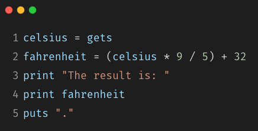
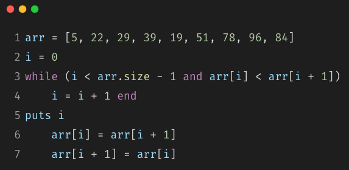

# Workbook - T1A1 - Nathan Blaga

## **Question 1:**

**Research** the development of the internet from 1980 to today. You must describe at least FIVE key events in the development of the internet. You can refer to events, people of significance, or technologies and how they have changed over time.

## **Answer 1:**

### **Question 2:**

**Define** the features of the following technologies that are essential in terms of the development of the internet:

- Packets.
- IP addresses (IPv4 and IPv6)
- Routers and routing
- Domains and DNS

**Explain** how each technology has contributed to the development of the internet.

### **Answer 2:**

### **Question 3:**

**Define** the features of the following technologies that are essential in terms of the development of the internet:

- TCP.
- HTTP and HTTPS.
- Web browsers. (requests, rendering and developer tools)

**Explain** how each technology has contributed to the development of client and server communication over the internet (50 - 150 words for each technology)

### **Answer 3:**

### **Question 4:**

**Identify** THREE data structures used in the Ruby programming language and explain the reasons for using each.

### **Answer 4:**

### **Question 5:**

**Describe** the features of interpreters and compilers and how they are different.

### **Answer 5:**

### **Question 6:**

**Identify** TWO commonly used programming languages and explain the benefits and drawbacks of each.

### **Answer 6:**

### **Question 7:**

**Identify** TWO ethical issues from the areas below and **discuss** the extent to which an IT professional is ethically responsible in terms of the issue.

List of topics containing ethical issues:

- Access to a user’s personal information (medical, family, financial, personal attributes such as sexuality, religion, or beliefs)  
- Intellectual property, copyright, and acknowledgement.
- Criminal acts such as theft, fraud, trafficking and distribution of prohibited substances, terrorism
- GPS tracking data and other types of metadata, MAC addresses, hardware fingerprints
- Freedom of thought, conscience, speech and the media
- Aggressive sales and marketing practices designed to mislead and deceive consumers
- Trading of shares on the stock exchange OR crypto-currencies

For each ethical issue identify a source of legal information relating to the ethical issue and discuss whether the law is helpful in assisting a developer to act in an ethical way. *(Word count guide: 200 words max)*

Conduct research into a case study of ONE of the ethical issues you have chosen discuss how an ethical IT professional should respond to the case study and how they might mitigate or prevent ethical breaches. *(Word count guide: 400 - 600 words)*

### **Answer 7:**

### **Question 8:**

Explain control flow, using an example from the Ruby programming language.

### **Answer 8:**

### **Question 9:**

Explain type coercion.

### **Answer 9:**

### **Question 10:**

Explain data types, using examples.

### **Answer 10:**

### **Question 11:**

Here’s the problem: “There is a restaurant serving a variety of food. The customers want to be able to buy food of their choice. All the staff just quit, how can you build an app to replace them?”

- Identify the classes you would use to solve the problem
- Write a short explanation of why you would use the classes you have identified.

### **Answer 11:**

### **Question 12:**

Identify and explain the error in the code snippet below that is preventing correct execution of the program:

### **Answer 12:**

### **Question 13:**

The code snippet below looks for the first two elements that are out of order and swaps them; however, it is not producing the correct results. Rewrite the code so that it works correctly:

### **Answer 13:**

### **Question 14:**

Demonstrate your algorithmic thinking through completing the following two tasks, in order:

 1. Create a flowchart to outline the steps for listing all prime numbers between 1 and 100 (inclusive). Your flowchart should make use of standard conventions for flowcharts to indicate processes, tasks, actions, or operations.
 1. Write pseudocode for the process outlined in your flowchart.

### **Answer 14:**

### **Question 15:**

Write pseudocode OR Ruby code for the following problem:
You have access to two variables: raining (boolean) and temperature (integer). If it’s raining and the temperature is less than 15 degrees, print to the screen *“It’s wet and cold”*, if it is less than 15 but not raining print *“It’s not raining but cold”.* If it’s greater than or equal to 15 but not raining print *“It’s warm but not raining”, and otherwise tell them “It’s warm and raining”.*

### **Answer 15:**

### **Question 16:**

An allergy test produces a single numeric score which contains the information about all the allergies the person has (that they were tested for). The list of items (and their value) that were tested are:

- Eggs (1)
- Peanuts (2)
- Shellfish (4)
- Strawberries (8)
- Tomatoes (16)
- Chocolate (32)
- Pollen (64)
- Cats (128)

So if Tom is allergic to peanuts and chocolate, he gets a score of 34.

Write a program that, given a person’s score can tell them:
 a) whether or not they’re allergic to a given item
 b) the full list of allergies.

### **Answer 16:**
